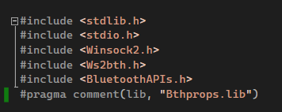

# Bluetooth Windows Esp32 Example

This repository is a sample on how to connect from a Windows 10 PC to an ESP32 via bluetooth and windows sockets. You should pair your PC with the ESP32 first. The console application will loop through the BT devices connected to the PC and find the ESP32, connect to it, send a message, and recieve a message. The Arduino.ino file should be loaded onto the ESP32. The Visual Studio project should be built (I used Visual Studio 2019). The actual source code is just contained in the .ino file and single .cpp file. The code should be simple to follow, unlike most of the examples and documentation I came across.


## References

* Helpful examples on getting connected devices - https://www.winsocketdotnetworkprogramming.com/winsock2programming/winsock2advancedotherprotocol4k.html
* Bluetooth APIs - https://docs.microsoft.com/en-us/windows/win32/api/bluetoothapis/
* Microsoft example - https://github.com/microsoftarchive/msdn-code-gallery-microsoft/blob/master/Official%20Windows%20Platform%20Sample/Bluetooth%20connection%20sample/%5BC%2B%2B%5D-Bluetooth%20connection%20sample/C%2B%2B/bthcxn.cpp
* Bluetooth programming with Windows sockets - https://docs.microsoft.com/en-us/windows/win32/bluetooth/bluetooth-programming-with-windows-sockets

## 2024 Addendum

When running this in 2024, with Visual Studio 2024 on a Windows 11 device, I encountered the following issues:


### Download C++ Tools for Visual Studio 2022

When I first loaded the project, I needed to install the C++ development tools. That was easy.

### Wasn't Linking Ws2_32.lib

Then I built the project, and encountered the following errors:

```
Build started...
1>------ Build started: Project: WindowsBtWithEsp32, Configuration: Debug x64 ------
1>WindowsBtWithEsp32.cpp
1>WindowsBtWithEsp32.obj : error LNK2019: unresolved external symbol __imp_closesocket referenced in function "bool __cdecl sendMessageToEsp32(void)" (?sendMessageToEsp32@@YA_NXZ)
1>WindowsBtWithEsp32.obj : error LNK2019: unresolved external symbol __imp_connect referenced in function "bool __cdecl connectToEsp32(void)" (?connectToEsp32@@YA_NXZ)
1>WindowsBtWithEsp32.obj : error LNK2019: unresolved external symbol __imp_ioctlsocket referenced in function "bool __cdecl connectToEsp32(void)" (?connectToEsp32@@YA_NXZ)
1>WindowsBtWithEsp32.obj : error LNK2019: unresolved external symbol __imp_recv referenced in function "bool __cdecl recieveMessageFromEsp32(void)" (?recieveMessageFromEsp32@@YA_NXZ)
1>WindowsBtWithEsp32.obj : error LNK2019: unresolved external symbol __imp_send referenced in function "bool __cdecl sendMessageToEsp32(void)" (?sendMessageToEsp32@@YA_NXZ)
1>WindowsBtWithEsp32.obj : error LNK2019: unresolved external symbol __imp_socket referenced in function "bool __cdecl connectToEsp32(void)" (?connectToEsp32@@YA_NXZ)
1>WindowsBtWithEsp32.obj : error LNK2019: unresolved external symbol __imp_WSAStartup referenced in function "bool __cdecl startupWindowsSocket(void)" (?startupWindowsSocket@@YA_NXZ)
1>WindowsBtWithEsp32.obj : error LNK2019: unresolved external symbol __imp_WSACleanup referenced in function "bool __cdecl sendMessageToEsp32(void)" (?sendMessageToEsp32@@YA_NXZ)
1>WindowsBtWithEsp32.obj : error LNK2019: unresolved external symbol __imp_WSAGetLastError referenced in function "bool __cdecl connectToEsp32(void)" (?connectToEsp32@@YA_NXZ)
1>WindowsBtWithEsp32.obj : error LNK2019: unresolved external symbol BluetoothFindFirstDevice referenced in function "bool __cdecl getPairedEsp32BtAddress(void)" (?getPairedEsp32BtAddress@@YA_NXZ)
1>WindowsBtWithEsp32.obj : error LNK2019: unresolved external symbol BluetoothFindNextDevice referenced in function "bool __cdecl getPairedEsp32BtAddress(void)" (?getPairedEsp32BtAddress@@YA_NXZ)
1>C:\dev\bluetooth-windows-esp32-example\WindowsBtWithEsp32\x64\Debug\WindowsBtWithEsp32.exe : fatal error LNK1120: 11 unresolved externals
1>C:\Program Files\Microsoft Visual Studio\2022\Community\MSBuild\Microsoft\VC\v170\Microsoft.CppCommon.targets(1127,5): error MSB6006: "link.exe" exited with code 1120.
1>Done building project "WindowsBtWithEsp32.vcxproj" -- FAILED.
========== Build: 0 succeeded, 1 failed, 0 up-to-date, 0 skipped ==========
========== Build started at 8:07 PM and took 03.596 seconds ==========
```

To fix this, I added `Ws2_32.lib` into my Additional Dependencies. As described in this [stack overflow](https://stackoverflow.com/a/53873194)

* Right click on my "WindowsBtWithEsp32" project in Solution Explorer
* Click Properties
* Go to Linker => Input. Click to edit Additional Dependencies
* Add `Ws2_32.lib` in the first box:


### Didn't Have Pragma comment

Then I built again, and received the following error:

```
Build started...
1>------ Build started: Project: WindowsBtWithEsp32, Configuration: Debug x64 ------
1>WindowsBtWithEsp32.obj : error LNK2019: unresolved external symbol BluetoothFindFirstDevice referenced in function "bool __cdecl getPairedEsp32BtAddress(void)" (?getPairedEsp32BtAddress@@YA_NXZ)
1>WindowsBtWithEsp32.obj : error LNK2019: unresolved external symbol BluetoothFindNextDevice referenced in function "bool __cdecl getPairedEsp32BtAddress(void)" (?getPairedEsp32BtAddress@@YA_NXZ)
1>C:\dev\bluetooth-windows-esp32-example\WindowsBtWithEsp32\x64\Debug\WindowsBtWithEsp32.exe : fatal error LNK1120: 2 unresolved externals
1>Done building project "WindowsBtWithEsp32.vcxproj" -- FAILED.
========== Build: 0 succeeded, 1 failed, 0 up-to-date, 0 skipped ==========
========== Build started at 8:12 PM and took 00.453 seconds ==========
```

To fix this I added this comment (`#pragma comment(lib, "Bthprops.lib")`) below my include statements



Then I could build and run the solution:


## This fork now works

This fork now contains fixes for these issues. Hopefully allowing anyone in the future to resolve these issues.